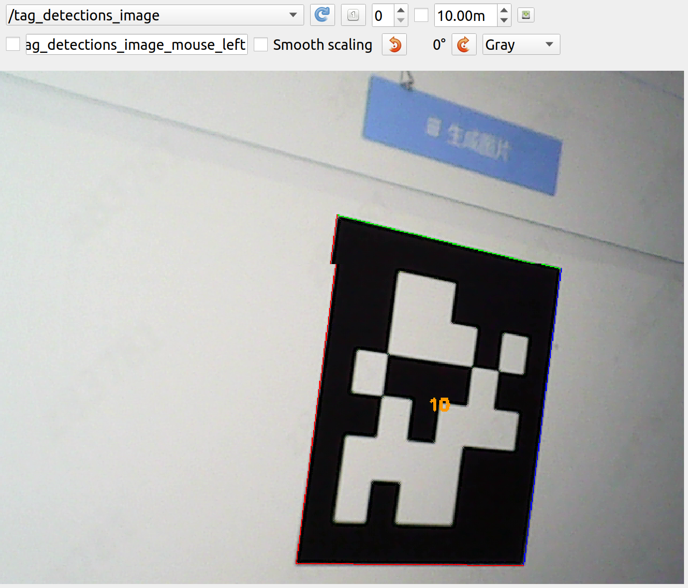
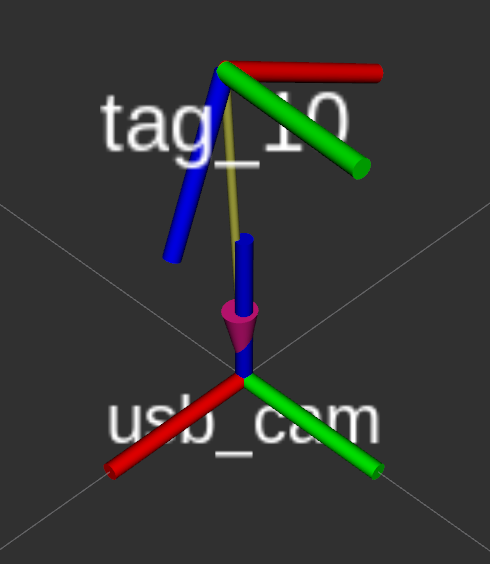

# AprilTag入门

首先，为了使用摄像头，建议在原生Ubuntu系统上跑程序。WSL需要重新编译Linux内核，而且也不一定能成功，需要折腾的可以找我要一些资料；虚拟机我没试过，主要是相比WSL和原生系统来说实在没多少优势。

## 安装包

```shell
sudo apt-get install ros-noetic-apriltag-ros
sudo apt-get install ros-noetic-usb-cam
sudo apt-get install ros-noetic-camera-calibration
```

## 标定摄像头

检查usb是否连接成功：

```shell
lsusb
```

检查摄像头是否识别成功：

```shell
ls -l /dev/video*
```

运行测试程序：

```shell
roslaunch usb_cam usb_cam-test.launch
```

运行标定程序，其中size为标定纸的大小（注意不是格子的行列数，是格子非边缘交点的行列数），square为格子的边长（单位米）：

```shell
rosrun camera_calibration cameraclibrator.py --size 7x5 --square 0.042 image:=/usb_cam/image_raw camera:=/usb_cam
```

上下左右移动摄像头，当calibrate变亮之后点击它，等待一会后save然后commit。标定文件默认保存在`~/.ros/camera_info/head_camera.yaml`，一般不需要管。

## 修改启动参数

使用`apt-get`安装的ros包默认放在`/opt/ros/noetic/share`下，也可以使用`rospack find`来搜索。

`/opt/ros/noetic/share/apriltag_ros/config`下有两个配置文件，主要需要配置`tags.yaml`，其中的`tag_bundles`是一组tags，而`standalone_tags`是单独的tag，我们这里只使用`standalone_tags`作为演示：

```yaml
standalone_tags:
  [
    {id: 10, size: 0.067}
  ]
```

然后修改`launch/continuous_detection.launch`文件，主要是修改相机和话题名，这些参数也可以在启动时指定：

```
  <arg name="camera_name" default="/usb_cam" />
  <arg name="image_topic" default="image_raw" />
```

## 检测视频流

准备完成后就可以运行了（记得先启动usb_cam）：

```shell
roslaunch apriltag_ros continuous_detection.launch
```

启动`rqt_image_view`，话题选择`/tag_detections_image`，可以看到识别到的图像信息：



之后启动`rviz`，可以在TF里面看到坐标系信息：



详细使用说明可以参考：

- [apriltag_ros/Tutorials/Detection in a video stream - ROS Wiki](http://wiki.ros.org/apriltag_ros/Tutorials/Detection%20in%20a%20video%20stream)